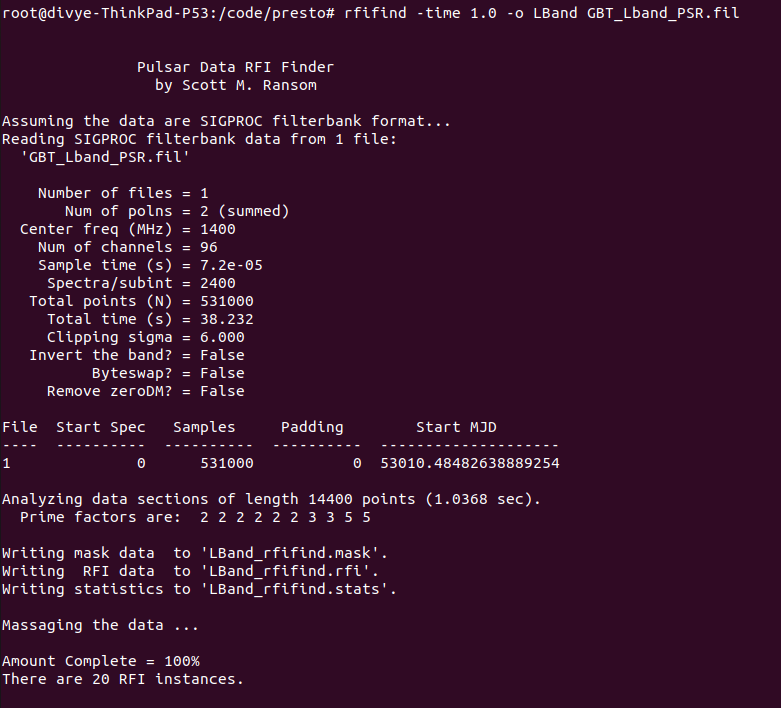

PRESTO USER MANUAL
==================

====================
AIM OF THE DOCUMENT:
====================

The Aim of this document is to create a simplified user manual for PRESTO. 

This document is to be used as an addendum to the PRESTO user manual by Scott Ranson.

The document contains the commands to be used, their functionality along with screenshots capturing the implementations.

Note: In case you are using PRESTO through Docker please refer to the following document:
PRESTO Using Docker

=========
DATABASE:
=========

For the purpose of this document, the database used is: PRESTO DATABASE .fil format

================
PRESTO COMMANDS:
================

In this section, the commands along with their functionalities are mentioned. The screenshots attached with each command showcase the way the commands need to be implemented.

1. **Readfile:** Examine the data format by printing the meta data.

2. **Rfifind:** Search for RFI in both time and frequency domain. There’s an option to provide the time limit (as shown in the second screenshot). Without the time parameter, the default value is 30 sec). The time parameter can be changed and its impact can be observed on the plot generated.

With no mention of time, we find 78 RFI Instances with no time parameter given (Default: time is 30 sec).

We see 20 RFI Instances with no time parameter given as 1 sec.

    **A. Rfifind for weights:**
    Generates two files and a pop up graph
        i. weights: shows which of the channels have been given a weight ‘0’ and which a weight ‘1’
        

The weight files

        ii. bandpass: gives information about the mean and the standard deviation of the channels.

The bandpass file

    **B. To ignore channels with weights ‘0’:**

    **C. Rfifind with Masking:**

3. **Prepdata:** creates a .dat file to be used for further computations
    A. Prepping the data without nobary: for barycentering the data 
    B. Prepdata with nobary: not barycentering the data

4. **Realfft and Explorefft:**
    The realfft command is run on the .dat file. This then generates a fft file. Further exploration of BEFORE explorefft).

5. **Accelsearch:** generates a “.inf” file containing periodic interferences.

6. **Birds file:**
    To nullify (or zap) the RFis, information related to the RFIs need to be provided to the PRESTO tool. This information is provided by creating a “birds file”. PRESTO takes the information from the Birds file and then tries to zap the corresponding frequencies.

    **Making a birds file:**
    A birds file needs to be created manually in the current directory (command: touch LBand.birds). Its a text file (with an extension: .birds).
    The inf file generated by the accelsearch command has information containing:
    Graph generated by explorefft:

    We search for the peaks (or spikes) in this graph and find the corresponding frequency. When combined with the information from the  file (generated by accelsearc command: LBand_Accel_0; gives the details of the RFI). The data from these two sources should corroborate each other.
    In the .birds file created, add the information as per the manual (PRESTO User Manual : Page 15) 

    Run Simple_zapbirds.py.: zaps the rfi instances as mentioned in the .birds file

7. **De-dispersion:** 
    Run DDplan.py. 
    An addition of the command -w generated a new file: disperse.py         
    This command will replace the existing disperse.py file (as downloaded from github).
   
    Note: failure to add the “-w” option will require manual updation of the values in the matrices present in the script dedisp.py 9as downloaded from Github).

.. image :: images/ddplancommandwoption.png

    

